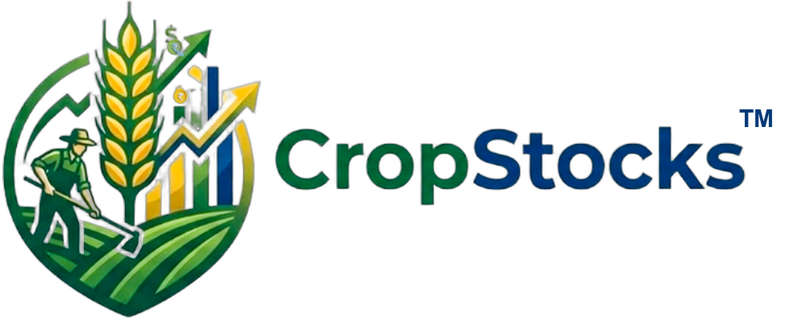

<h1 align="center">
   CropStocks™
</h1>

> A "stock market for agricultural produce" — connecting farmers who need upfront capital with investors who fund crop/animal husbandry cycles in exchange for profit-sharing at harvest/sale.



---

## 🚀 Quick Start

### Prerequisites
- **Node.js** v18+ 
- **npm** v9+

### Installation

```bash
# Clone the repository
git clone https://github.com/cropstocks/CropStocks.git
cd CropStocks

# Install root dependencies (concurrently)
npm install

# Install client dependencies
cd client && npm install && cd ..

# Install server dependencies
cd server && npm install && cd ..
```

### Database Setup

```bash
cd server

# Create .env file
echo DATABASE_URL="file:./dev.db" > .env
echo JWT_SECRET="your-secret-key-here" >> .env
echo PORT=5000 >> .env

# Run database migration
npx prisma migrate dev --name init

# Seed the database with demo data
node prisma/seed.js
```

### Run Development Servers

```bash
# From project root — starts both client and server
npm run dev
```

Or run individually:
```bash
# Terminal 1: Backend (http://localhost:5000)
npm run dev:server

# Terminal 2: Frontend (http://localhost:5173)
npm run dev:client
```

---

## 🔑 Demo Accounts

| Role | Email | Password |
|------|-------|----------|
| 🧑‍🌾 Farmer | farmer@example.com | farmer123 |
| 💰 Investor | investor@example.com | investor123 |
| 👑 Admin | admin@cropstocks.in | admin123 |

---

## 🏗️ Tech Stack

| Layer | Technology |
|-------|-----------|
| **Frontend** | React 19 + Vite, TailwindCSS v3, React Router v7 |
| **Backend** | Node.js + Express, REST API |
| **Database** | SQLite (dev) / PostgreSQL (prod) via Prisma ORM |
| **Auth** | JWT with Role-Based Access Control (RBAC) |
| **File Storage** | Local filesystem (MVP) |

---

## 📁 Project Structure

```
CropStocks/
├── client/                    # React frontend
│   ├── src/
│   │   ├── components/        # Reusable UI components
│   │   ├── pages/             # Route-level pages
│   │   ├── context/           # React Context (Auth, Locale)
│   │   ├── services/          # API client
│   │   └── i18n/              # Localization (EN/HI)
│   └── ...
├── server/                    # Express backend
│   ├── src/
│   │   ├── routes/            # API route handlers
│   │   ├── middleware/        # Auth & RBAC middleware
│   │   ├── services/          # Business logic engines
│   │   └── utils/             # Helpers
│   └── prisma/                # Database schema & migrations
└── package.json               # Root orchestration
```

---

## 🔄 Core User Flows

### For Farmers
1. **Register** → KYC verification → Farm details
2. **Create Listing** → Capital calculator auto-computes requirements
3. **Receive Funding** → Inputs/capital disbursed when fully funded
4. **Post Updates** → Progress photos/notes at milestones
5. **Report Harvest** → Revenue split distributed automatically

### For Investors
1. **Register** → Wallet setup
2. **Browse Marketplace** → Filter by crop, region, risk, insurance
3. **Invest** → Fractional investment in listings
4. **Track Progress** → Live timeline per funded listing
5. **Receive Payouts** → Profit share or insurance reimbursement

### For Admins
1. **Verify Farmers** → KYC approval queue
2. **Approve Listings** → Feasibility & risk check
3. **Manage Payouts** → Disbursement oversight
4. **Insurance Claims** → Failure verification & reimbursement

---

## 🌍 Mission

CropStocks aims to:
- **Eliminate farmer debt spirals** by replacing informal moneylenders with transparent, community-funded capital
- **Protect farmers from loss** via platform-backed insurance — zero repayment obligation on crop failure
- **Provide safe agri-investments** for retail investors with principal protection
- **Reduce farmer suicides** by providing a dignified safety net

---

## 📄 API Endpoints

### Auth
- `POST /api/auth/register` — Register (farmer/investor)
- `POST /api/auth/login` — Login → JWT token
- `GET /api/auth/me` — Current user profile

### Listings
- `GET /api/listings` — Browse marketplace
- `GET /api/listings/:id` — Listing detail
- `POST /api/listings` — Create listing (Farmer)
- `POST /api/listings/:id/harvest` — Report harvest (Farmer)

### Investments
- `POST /api/investments` — Invest in a listing (Investor)
- `GET /api/investments/my` — Investor portfolio
- `GET /api/investments/listing/:id` — Investments per listing

### Admin
- `GET /api/admin/listings` — All listings
- `GET /api/admin/farmers` — Farmer verification queue
- `PUT /api/admin/farmers/:id/verify` — Verify farmer
- `PUT /api/listings/:id/approve` — Approve listing

### Progress & Guidance
- `POST /api/progress/:listingId` — Post update
- `GET /api/progress/:listingId` — Get updates
- `GET /api/guidance/:listingId` — Get farming tips

---

## 🌐 Localization

The app supports **English** and **Hindi** with a toggle in the navbar. Farmer-facing screens use simple, plain language.

---

## 📝 License

MIT License. Copyright (c) 2026 CropStocks. All rights reserved.

See the [LICENSE](LICENSE) file for details.

---

## 🛡️ Branding & Logo Usage

The project logo, brand name, icon, and related assets are proprietary works under copyright. 
While the codebase may be open-source, the logo, icon, and branding cannot be used to represent unauthorized forks, derivative projects, or related services without explicit written permission.

---

*Built with ❤️ for Indian farmers and the agricultural community.*
